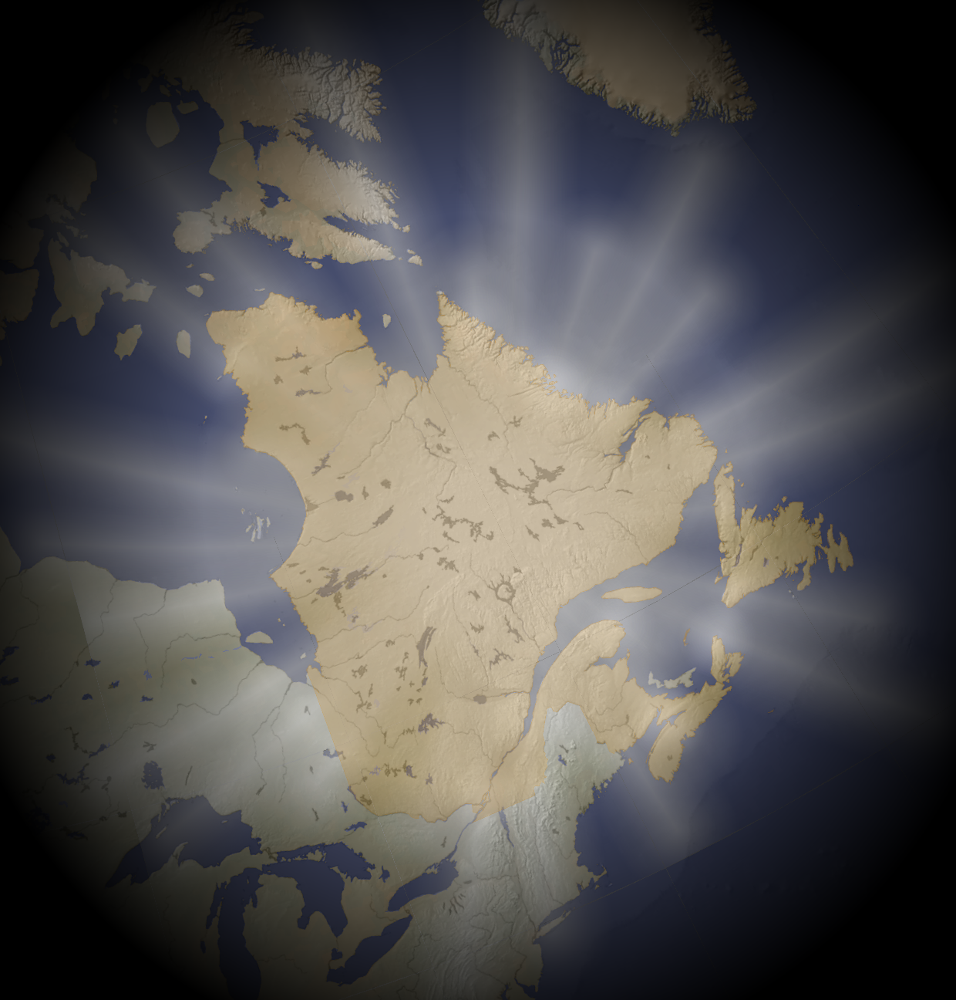

# Maptember 2021
It's been a wild year since I last saddled up to make a whole batch of maps! A pandemic waned, waxed, and maybe waned again. A few regimes turned over. Perhaps most pertinently, I took my itinerant mapmaking to [Mapbox](https://www.mapbox.com/), where I work with excellent colleagues on processing satellite imagery.

This year will be a bit more haphazard, a bit less disciplined. I beg your understanding and indulgence, good people of the map. Onward!

## Groundwork
Having a scratch PostGIS database for processing never hurt, so I'll start there.

```sh
createdb maptember_2021
psql maptember_2021 -c "CREATE EXTENSION postgis;CREATE EXTENSION postgis_raster;"
```

For data, I'll look North (at least at first) to a city I've greatly missed over these two years: Montréal. Données Québec [has an excellent open data page for Montréal](https://www.donneesquebec.ca/organisation/ville-de-montreal/), similar in scope to the [VCGI](https://vcgi.vermont.gov/) resources I used last year. Note there's [some intrigue with download methods](https://www.donneesquebec.ca/foire-aux-questions/#ftp), but `curl` or `wget` seems to do the trick.


## Day 1: Points
The Metro! Let's grab data on the inimitable rubber-tired subway of Montréal, along with all the bus routes.

```sh
cd data/
wget -c http://www.stm.info/sites/default/files/gtfs/stm_sig.zip --no-check-certificate
unzip stm_sig.zip
```

. . . and import it to the database

```sh
ogr2ogr -t_srs "EPSG:4326" -f "PostgreSQL" PG:"dbname=maptember_2021" stm_arrets_sig.shp -overwrite -nln stm_arrets_sig -progress
```

. . . then send it to GeoJSON for import to Mapbox tile service:
```sh
ogr2ogr -t_srs "EPSG:4326" \
  -f "GeoJSON" stm_arrets_sig.geojson \
  PG:"dbname=maptember_2021" \
  -sql "SELECT stop_id,stop_name,loc_type,wkb_geometry FROM stm_arrets_sig" \
  -lco RFC7946=YES
```

. . . where we [style it](https://api.mapbox.com/styles/v1/landplanner/ckvheg58913ya14nb1tns21d7.html?title=copy&access_token=pk.eyJ1IjoibGFuZHBsYW5uZXIiLCJhIjoiY2pmYmpmZmJrM3JjeTMzcGRvYnBjd3B6byJ9.qr2gSWrXpUhZ8vHv-cSK0w&zoomwheel=true&fresh=true#14.36/45.50529/-73.59485/318/65).


## Day 2: Lines
The obvious followup to the transit stops is to show the lines themselves!

To PostGIS:
```sh
ogr2ogr -t_srs "EPSG:4326" -f "PostgreSQL" PG:"dbname=maptember_2021" stm_lignes_sig.shp -overwrite -nln stm_lignes_sig -progress
```
To GeoJSON:
```sh
ogr2ogr -t_srs "EPSG:4326" \
  -f "GeoJSON" stm_lignes_sig.geojson \
  PG:"dbname=maptember_2021" \
  -sql "SELECT route_name,wkb_geometry FROM stm_lignes_sig" \
  -lco RFC7946=YES
```

. . . and [back to Mapbox Studio](https://api.mapbox.com/styles/v1/landplanner/ckvih7nfm0wk014lc4cyw0ecd.html?title=copy&access_token=pk.eyJ1IjoibGFuZHBsYW5uZXIiLCJhIjoiY2pmYmpmZmJrM3JjeTMzcGRvYnBjd3B6byJ9.qr2gSWrXpUhZ8vHv-cSK0w&zoomwheel=true&fresh=true#14.36/45.50529/-73.59485/318/65).


## Day 3: Polygons
Let's actually pre-grab a bunch of data. This is good stuff.

```sh
# fire stations
wget -c https://data.montreal.ca/dataset/c69e78c6-e454-4bd9-9778-e4b0eaf8105b/resource/beff8ce0-7a61-4a82-95b5-96d89bafa671/download/casernes.geojson
# former admin territories
wget -c https://data.montreal.ca/dataset/87fb795b-f0aa-414d-a38e-f896d13a14ae/resource/ab340339-ef7a-4112-970a-323a6b24a58e/download/anciennes-municipalites.geojson
# administrative bounds
wget -c https://data.montreal.ca/dataset/00bd85eb-23aa-4669-8f1b-ba9a000e3dd8/resource/e9b0f927-8f75-458c-8fda-b5da65cc8b73/download/limadmin.geojson
# social/community housing
wget -c https://data.montreal.ca/dataset/d26fad0f-2eae-44d5-88a0-2bc699fd2592/resource/1c02ead8-f680-495f-9675-6dd18bd3cad0/download/logsoc_donneesouvertes_20191231.geojson
# electoral catchments
wget -c https://data.montreal.ca/dataset/c4a55dcc-531d-4f5c-b3c2-de73fac021f5/resource/af77dffd-cbba-430a-b526-ada16485a658/download/bassins-electoraux-2021.geojson
# former quarries
wget -c https://data.montreal.ca/dataset/d332b1ef-95af-42d8-a996-7e451f1c6722/resource/56810fb3-18cf-44e5-b402-7dceef468cd8/download/anciennes_carrieres_depot_surface.geojson
# restaurants
wget -c https://data.montreal.ca/dataset/c1d65779-d3cb-44e8-af0a-b9f2c5f7766d/resource/ece728c7-6f2d-4a51-a36d-21cd70e0ddc7/download/businesses.geojson
# POIs
wget -c https://data.montreal.ca/dataset/763fe3b8-cdc3-4b8a-bbbd-a0a9bc587c56/resource/5ca7cdb8-f86f-4038-b5a8-657446c75427/download/lieux_d_interet.geojson
# ecoregions
wget -c https://data.montreal.ca/dataset/942ae48f-ba0c-4e33-bb81-b6da50d9d13d/resource/295d94b9-8515-4a7c-9bc2-0e661582f4d7/download/ecoterritoires.geojson
# police districts
wget -c https://data.montreal.ca/dataset/186892b8-bba5-426c-aa7e-9db8c43cbdfe/resource/e18f0da9-3a16-4ba4-b378-59f698b47261/download/limitespdq.geojson
```

. . . and let's style the city police districts.

To PostGIS:
```sh
ogr2ogr -t_srs "EPSG:4326" -f "PostgreSQL" PG:"dbname=maptember_2021" limitespdq.geojson -overwrite -nln limitespdq -nlt PROMOTE_TO_MULTI -lco GEOMETRY_NAME=the_geom -progress
```

Assign a color scheme (this'll be easier now, rather than later)
```sh
psql maptember_2021 -c "ALTER TABLE limitespdq ADD COLUMN color text;
  UPDATE limitespdq
  SET color = (
    CASE
      WHEN random() < 0.2 THEN '0A92AD'
      WHEN random() BETWEEN 0.2 AND 0.4 THEN '45717A'
      WHEN random() BETWEEN 0.4 AND 0.6 THEN '24E098'
      WHEN random() BETWEEN 0.6 AND 0.8 THEN 'E4615E'
      WHEN random() >= 0.8 THEN 'AD0A4D'
      ELSE '0A92AD'
    END
  );
"
```

To GeoJSON:
```sh
ogr2ogr -t_srs "EPSG:4326" \
  -f "GeoJSON" limitespdq_color.geojson \
  PG:"dbname=maptember_2021" \
  -sql "SELECT color,the_geom FROM limitespdq" \
  -lco RFC7946=YES
```

In [Mapbox Studio](https://api.mapbox.com/styles/v1/landplanner/ckvk65dv1137q14o26si8cre8.html?title=copy&access_token=pk.eyJ1IjoibGFuZHBsYW5uZXIiLCJhIjoiY2pmYmpmZmJrM3JjeTMzcGRvYnBjd3B6byJ9.qr2gSWrXpUhZ8vHv-cSK0w&zoomwheel=true&fresh=true#9.69/45.5074/-73.6783/330.3)


## Day 4: Hexagons
Hearkening back to last year's entry, I'll again use an excellent PostGIS hexbin function from the good folks at [Carto](https://github.com/CartoDB/cartodb-postgresql/blob/362af5e6a0792ce65e8a842cdc1c0dd36d6da6ad/scripts-available/CDB_Hexagon.sql):

`psql maptember_2021 -f ../../2020/lib/cdb_functions.sql`

. . . and then it's high time we created a containing geometry for the Isle de Montréal. This is for cartographic pleasantries, not administrative precision.

```sh
psql maptember_2021 -c "DROP TABLE IF EXISTS montreal_bound;
  CREATE TABLE montreal_bound AS (
    SELECT
      ST_Multi(
        ST_Union(
          ST_Buffer(the_geom, 0.001)
        )
      ) AS the_geom
    FROM limitespdq
  );
"
```

. . . and from [Statistics Canada](https://www12.statcan.gc.ca/census-recensement/2011/geo/bound-limit/bound-limit-2016-eng.cfm), the metro boundary:

```sh
wget -c https://www12.statcan.gc.ca/census-recensement/2011/geo/bound-limit/files-fichiers/2016/lcma000b16a_e.zip
unzip lcma000b16a_e.zip
ogr2ogr -t_srs "EPSG:4326" -f "PostgreSQL" PG:"dbname=maptember_2021" lcma000b16a_e.shp -overwrite -nln montreal_metro -nlt PROMOTE_TO_MULTI -lco GEOMETRY_NAME=the_geom -sql "SELECT * FROM lcma000b16a_e WHERE CMAUID = '462'" -progress
```

. . . and food businesses from Donnés Québec

```sh
ogr2ogr -t_srs "EPSG:4326" -f "PostgreSQL" PG:"dbname=maptember_2021" businesses.geojson -overwrite -nln businesses -lco GEOMETRY_NAME=the_geom -progress
```

Let's set up some hexagons!
```sh
psql maptember_2021 -c "DROP TABLE IF EXISTS day_4;
  CREATE TABLE day_4 AS (
    -- add a grid over the bbox of the city
    WITH grid AS (
      SELECT
        CDB_HexagonGrid(ST_Transform(the_geom,32188),250) AS the_geom_32188
      FROM montreal_bound
    )
    -- Intersect w/ businesses
    SELECT
      g.the_geom_32188,
      count(b.ogc_fid) AS count
    FROM grid g
    JOIN businesses b ON ST_Intersects(g.the_geom_32188,ST_Transform(b.the_geom,32188))
    GROUP BY g.the_geom_32188
  );
"
```

And it's about time we automated the Mapbox end of things. Let's use the [MTS API](https://docs.mapbox.com/help/tutorials/get-started-mts-and-tilesets-cli/).

```sh
# Export to geojsonl
ogr2ogr -t_srs "EPSG:4326" \
  -f "GeoJSONSeq" day_4.geojson.ld \
  PG:"dbname=maptember_2021" \
  -sql "SELECT * FROM day_4"

# configure and publish
tilesets upload-source landplanner day-4-source day_4.geojson.ld

echo '{
  "version": 1,
  "layers": {
    "day_4": {
      "source": "mapbox://tileset-source/landplanner/day-4-source",
      "minzoom": 0,
      "maxzoom": 13
    }
  }
}' > day_4_recipe.json

tilesets create landplanner.day-4-tiles --recipe day_4_recipe.json --name "day_4"
tilesets publish landplanner.day-4-tiles
```

And added to [the day's style](https://api.mapbox.com/styles/v1/landplanner/ckvl275cw3f4714lc6vneasnw.html?title=copy&access_token=pk.eyJ1IjoibGFuZHBsYW5uZXIiLCJhIjoiY2pmYmpmZmJrM3JjeTMzcGRvYnBjd3B6byJ9.qr2gSWrXpUhZ8vHv-cSK0w&zoomwheel=true&fresh=true#9.69/45.5074/-73.6783/330.3).


## Day 5: Data challenge 1 - OSM

Hitting the OSM API is always entertaining, so let's try narrow in and collect all roadlines within the bbox of Montreal, with the help of [osm2pgsql](https://osm2pgsql.org/examples/buildings/).

First, get the Geofabrik download for quebec
```sh
wget -c "https://download.geofabrik.de/north-america/canada/quebec-latest.osm.pbf"
```

Then the boundary of Montreal from OSM
```sh
wget -c -O montreal.osm "https://www.openstreetmap.org/api/0.6/relation/1571328/full"
```

Extract the city with [osmium](https://osmcode.org/osmium-tool/)
```sh
brew install osmium-tool
osmium extract -p montreal.osm -o montreal.osm.pbf quebec-latest.osm.pbf
```

Bring it into the DB
```sh
brew install osm2pgsql
osm2pgsql -d maptember_2021 montreal.osm.pbf
```

That is WAY faster than expected :) It creates a `planet_osm_line` layer that we'll use below. Now let's make circular punchouts for the hell of it.

```sh
psql maptember_2021 -c "DROP TABLE IF EXISTS day_5;
  CREATE TABLE day_5 AS (
    -- Set random points around montreal
    WITH randos AS (
      SELECT
        gen_random_uuid() AS id,
        (ST_Dump(ST_GeneratePoints(ST_Transform(the_geom,32188),5))).geom AS the_geom_32188
      FROM montreal_bound
    ),
    -- set a radius 40% of the distance to the next nearest point (https://gis.stackexchange.com/questions/39210/nearest-neighbor-within-table-using-postgis)
    radii AS (
      SELECT
        i.id,
        b_id,
        the_geom_32188,
        ST_Distance(i.the_geom_32188, i.b_the_geom_32188) AS dist
      FROM(
        SELECT
          a.id,
          b.id AS b_id,
          a.the_geom_32188,
          b.the_geom_32188 AS b_the_geom_32188,
          rank() OVER (PARTITION BY a.id ORDER BY ST_Distance(a.the_geom_32188, b.the_geom_32188)) AS pos
        FROM randos a, randos b
        WHERE a.id <> b.id
      ) i
      WHERE pos = 1
    ),
    -- make the punchouts
    windows AS (
      SELECT
        ST_Buffer(the_geom_32188, (dist * 0.4)) AS the_geom_32188
      FROM radii
    )
    -- clip the OSM roads data
    SELECT
      ST_Intersection(w.the_geom_32188,ST_Transform(l.way,32188)) AS the_geom_32188
    FROM planet_osm_line l
    JOIN windows w ON ST_Intersects(w.the_geom_32188,ST_Transform(l.way,32188))
  );
"
```

```sh
# Export to geojsonl
ogr2ogr -t_srs "EPSG:4326" \
  -f "GeoJSONSeq" day_5.geojson.ld \
  PG:"dbname=maptember_2021" \
  -sql "SELECT * FROM day_5"

# configure and publish
tilesets upload-source landplanner day-5-source day_5.geojson.ld

echo '{
  "version": 1,
  "layers": {
    "day_5": {
      "source": "mapbox://tileset-source/landplanner/day-5-source",
      "minzoom": 0,
      "maxzoom": 16
    }
  }
}' > day_5_recipe.json

tilesets create landplanner.day-5-tiles --recipe day_5_recipe.json --name "day_5"
tilesets publish landplanner.day-5-tiles
```

[New style](https://api.mapbox.com/styles/v1/landplanner/ckvlmoupf8qfo14laqi5vbz3g.html?title=copy&access_token=pk.eyJ1IjoibGFuZHBsYW5uZXIiLCJhIjoiY2pmYmpmZmJrM3JjeTMzcGRvYnBjd3B6byJ9.qr2gSWrXpUhZ8vHv-cSK0w&zoomwheel=true&fresh=true#9.69/45.5074/-73.6783/330.3)!


## Day 6: Red

Keeping it entirely in Mapbox studio today, [leveraging the `raster-hue-rotate` property](https://api.mapbox.com/styles/v1/landplanner/ckvmhyhzr628b14nby8qramuz.html?title=copy&access_token=pk.eyJ1IjoibGFuZHBsYW5uZXIiLCJhIjoiY2pmYmpmZmJrM3JjeTMzcGRvYnBjd3B6byJ9.qr2gSWrXpUhZ8vHv-cSK0w&zoomwheel=true&fresh=true#9.69/45.5074/-73.6783/330.3) on the imagery layer.


## Day 7: Green

[New style](https://api.mapbox.com/styles/v1/landplanner/ckvmiogdr0pvb14mt7ll64dmq.html?title=copy&access_token=pk.eyJ1IjoibGFuZHBsYW5uZXIiLCJhIjoiY2pmYmpmZmJrM3JjeTMzcGRvYnBjd3B6byJ9.qr2gSWrXpUhZ8vHv-cSK0w&zoomwheel=true&fresh=true#9.69/45.5074/-73.6783/330.3)


## Day 8: Blue

[New style](https://api.mapbox.com/styles/v1/landplanner/ckvp78v0u8oy214nbqxn7vsdw.html?title=copy&access_token=pk.eyJ1IjoibGFuZHBsYW5uZXIiLCJhIjoiY2pmYmpmZmJrM3JjeTMzcGRvYnBjd3B6byJ9.qr2gSWrXpUhZ8vHv-cSK0w&zoomwheel=true&fresh=true#9.69/45.5074/-73.6783/330.3)


## Day 9: Monochrome

Mapbox Studio [is already tricked out with an excellent monochrome style generator](https://api.mapbox.com/styles/v1/landplanner/ckvperdbs0kt114muiizf8acb.html?title=copy&access_token=pk.eyJ1IjoibGFuZHBsYW5uZXIiLCJhIjoiY2pmYmpmZmJrM3JjeTMzcGRvYnBjd3B6byJ9.qr2gSWrXpUhZ8vHv-cSK0w&zoomwheel=true&fresh=true#9.69/45.5074/-73.6783/330.3), so I'm not going to get fancy [like I did last year](https://github.com/wboykinm/maptember/tree/main/2020#day-9-monochrome). However, I _am_ going to abuse the Pop Art motif.

After exporting with the [Studio print function](https://blog.mapbox.com/high-resolution-printing-arrives-in-mapbox-studio-cc0fafdba898), I'll mosaic with [imagemagick](https://legacy.imagemagick.org/Usage/montage/#montage):

```sh
montage img/day_9a.png img/day_9b.png img/day_9c.png img/day_9d.png \
  -geometry +2+2 img/day_9.png
```


## Day 10: Raster

_Oh yay it's my day job :)_

Let's use some [Sentinel 2](https://sentinel.esa.int/web/sentinel/missions/sentinel-2) imagery for this one, and some raster tools [detailed in this Mapbox tutorial](https://docs.mapbox.com/help/tutorials/processing-satellite-imagery/). The images are accessible from Sentinel Hub, or from [USGS Earth Explorer](https://earthexplorer.usgs.gov/), and they're pretty dang timely, too. Acquired on day 6 of this challenge! Two scenes cover the Montreal area:

- `L1C_T18TWR_A024390_20211106T155550`
- `L1C_T18TXR_A024390_20211106T155550`

Grab and unzip:

```sh
unzip L1C_T18TWR_A024390_20211106T155550.zip
unzip L1C_T18TXR_A024390_20211106T155550.zip
```

Grab the desired bands and stack them, [considering the Sentinel 2 spectral band assignments](https://sentinels.copernicus.eu/web/sentinel/user-guides/sentinel-2-msi/resolutions/spatial).

```sh
rio stack --rgb S2B_MSIL1C_20211106T155439_N0301_R054_T18TWR_20211106T193705.SAFE/GRANULE/L1C_T18TWR_A024390_20211106T155550/IMG_DATA/T18TWR_20211106T155439_B0{4,3,2}.jp2 -o T18TWR_stack.tif -f "GTiff" --overwrite
rio stack --rgb S2B_MSIL1C_20211106T155439_N0301_R054_T18TXR_20211106T193705.SAFE/GRANULE/L1C_T18TXR_A024390_20211106T155550/IMG_DATA/T18TXR_20211106T155439_B0{4,3,2}.jp2 -o T18TXR_stack.tif -f "GTiff" --overwrite

```
Mosaic the two scenes and reproject

```sh
rio merge T18TWR_stack.tif T18TXR_stack.tif -o T18_stack.tif -f "GTiff" --overwrite
rio warp T18_stack.tif T18_geog.tif --dst-crs EPSG:4326 --overwrite
```

Clip to montreal bounds

```sh
ogr2ogr -f "GeoJSON" montreal_bound.geojson \
  PG:"dbname=maptember_2021" \
  -sql "SELECT ST_Simplifypreservetopology(the_geom,0.001) FROM montreal_bound" \
  -lco RFC7946=YES
rio mask T18_geog.tif -o T18_mask.tif --geojson-mask - --overwrite < montreal_bound.geojson
```

Rescale to 0-255
```sh
gdal_translate -of "GTiff" -scale 0 65535 0 255 -ot Byte T18_mask.tif T18_byte.tif
```

Color correct

Let's punch up the color on the green a little bit, and oversaturate the whole thing a smidge.

```sh
rio color T18_byte.tif T18_color.tif gamma g 2.0 gamma br 1.95 sigmoidal rgb 85 0.13 saturation 1.15
```

And publish!

```sh
tilesets upload-source landplanner day-10-source T18_color.tif

echo '{
  "version": 1,
  "layers": {
    "day_10": {
      "source": "mapbox://tileset-source/landplanner/day-10-source",
      "minzoom": 0,
      "maxzoom": 14
    }
  }
}' > day_10_recipe.json

tilesets create landplanner.day-10-tiles --recipe day_10_recipe.json --name "day_10"
tilesets publish landplanner.day-10-tiles
```

[New style](https://api.mapbox.com/styles/v1/landplanner/ckvsle95w00tm14phes2rrqqb.html?title=copy&access_token=pk.eyJ1IjoibGFuZHBsYW5uZXIiLCJhIjoiY2pmYmpmZmJrM3JjeTMzcGRvYnBjd3B6byJ9.qr2gSWrXpUhZ8vHv-cSK0w&zoomwheel=true&fresh=true#9.69/45.5074/-73.6783/330.3)


## Day 11: 3D

Let's try some buildings and mountains! Once again Données Québec has excellent building data, though it's a bit broken up and needs reassembly.

Grab and ingest all the necessary data to the DB, using a text file with [these URLs](https://www.donneesquebec.ca/recherche/dataset/vmtl-batiment-2d#) scraped into it.

```sh
mkdir tmp
cd tmp
psql maptember_2021 -c "DROP TABLE IF EXISTS batiment_cote; DROP TABLE IF EXISTS batiment_toit;"
while IFS= read -r c; do
  wget -c ${c}
  FILE="${c##*/}"
  unzip $FILE
  echo "Extracting $FILE"
  # Add the point and polygon components to the DB
  ogr2ogr -t_srs "EPSG:4326" -f "PostgreSQL" PG:"dbname=maptember_2021" "CARTO-BAT-COTE.shp" -append -nln batiment_cote -lco GEOMETRY_NAME=the_geom -progress -nlt PROMOTE_TO_MULTI
  ogr2ogr -t_srs "EPSG:4326" -f "PostgreSQL" PG:"dbname=maptember_2021" "CARTO-BAT-TOIT.shp" -append -nln batiment_toit -lco GEOMETRY_NAME=the_geom -progress -nlt PROMOTE_TO_MULTI
  # clean up for the next one
  rm -rf *
done < ../batiment_urls.txt
cd ../
rm -r tmp/
```

Also grab the local DEM from [Opendata Canada](https://open.canada.ca/data/en/dataset/7f245e4d-76c2-4caa-951a-45d1d2051333/resource/6db38ca4-9f94-4e04-b746-c8ebeb78bb93), because the building dataset heights are reported as absolute elevation. Mercifully, the city is covered by 1 DEM.

```sh
wget -c https://ftp.maps.canada.ca/pub/nrcan_rncan/elevation/cdem_mnec/031/cdem_dem_031H_tif.zip
unzip cdem_dem_031H_tif.zip
# send it to the DB
raster2pgsql -I -F -s 4617 -t 100x100 cdem_dem_031H.tif cdem_dem_031h | psql maptember_2021
```

With a really expensive join, combine the footprints with the building height points, choosing the highest of each polygon (major oversimplification, but it'll have to do for now).

```sh
psql maptember_2021 -c "DROP TABLE IF EXISTS batiment;
  CREATE TABLE batiment AS (
    WITH joined AS (
      SELECT
        replace(replace(c.elevation,',','.'),' ','')::float AS elev_m,
        t.the_geom
      FROM batiment_toit t
      JOIN batiment_cote c ON ST_Intersects(c.the_geom,t.the_geom)
    )
    SELECT
      max(elev_m) AS elev_m,
      count(elev_m) AS count_cote,
      the_geom
    FROM joined
    GROUP BY the_geom
  )
"
```

We do a bit of a dance to use the [`rasterstats`](https://pythonhosted.org/rasterstats/cli.html) module for `rasterio`:

```sh
# export to geojson
ogr2ogr -t_srs "EPSG:4326" \
  -f "GeoJSON" batiment.geojson \
  PG:"dbname=maptember_2021" \
  -sql "SELECT * FROM batiment"

# get elevation stats
fio cat batiment.geojson | rio zonalstats -r cdem_dem_031H.tif > batiment_elev.geojson

# back to the DB
ogr2ogr -t_srs "EPSG:4326" -f "PostgreSQL" PG:"dbname=maptember_2021" "batiment_elev.geojson" -nln batiment_elev -lco GEOMETRY_NAME=the_geom -progress -nlt PROMOTE_TO_MULTI

# get relative building height
psql maptember_2021 -c "DROP TABLE IF EXISTS batiments;
  CREATE TABLE batiments AS (
    SELECT
      COALESCE((elev_m - _mean),elev_m) AS bld_height_m,
      _mean AS base_height_m,
      (CASE WHEN _mean > -50 THEN true ELSE false END) AS has_relative,
      the_geom
    FROM batiment_elev
  )
"
```

Export and send to a tileset!

```sh
# Export to geojsonl
ogr2ogr -t_srs "EPSG:4326" \
  -f "GeoJSONSeq" day_11.geojson.ld \
  PG:"dbname=maptember_2021" \
  -sql "SELECT * FROM batiments"

# configure and publish
tilesets upload-source landplanner day-11-source day_11.geojson.ld

echo '{
  "version": 1,
  "layers": {
    "day_11": {
      "source": "mapbox://tileset-source/landplanner/day-11-source",
      "minzoom": 9,
      "maxzoom": 16
    }
  }
}' > day_11_recipe.json

tilesets create landplanner.day-11-tiles --recipe day_11_recipe.json --name "day_11"
tilesets publish landplanner.day-11-tiles
```

Because Mapbox Studio has gotten pretty sophisticated with the 3D, I'll run everything through [this style](https://api.mapbox.com/styles/v1/landplanner/ckvts1b060sqf14qt6dwgg78c.html?title=copy&access_token=pk.eyJ1IjoibGFuZHBsYW5uZXIiLCJhIjoiY2pmYmpmZmJrM3JjeTMzcGRvYnBjd3B6byJ9.qr2gSWrXpUhZ8vHv-cSK0w&zoomwheel=true&fresh=true#9.69/45.5074/-73.6783/330.3).


## Day 12: Population

Let's get the Canadian equivalent of block groups (Dissemination areas) from [Stats Canada](https://www12.statcan.gc.ca/census-recensement/alternative_alternatif.cfm?l=eng&dispext=zip&teng=lda_000b16a_e.zip&k=%20%20%20%2090414&loc=http://www12.statcan.gc.ca/census-recensement/2011/geo/bound-limit/files-fichiers/2016/lda_000b16a_e.zip)!

```sh
wget -c https://www12.statcan.gc.ca/census-recensement/2011/geo/bound-limit/files-fichiers/2016/lda_000b16a_e.zip
unzip lda_000b16a_e.zip
```

And tabular data [From here](https://www12.statcan.gc.ca/census-recensement/2016/dp-pd/hlt-fst/pd-pl/comprehensive.cfm), as `T1901EN.csv`, then preprocess out the population data.

```sh
echo "geo_code,population_2016" > dissemination_area_stats.csv
head -n $(( $(wc -l T1901EN.csv | awk '{print $1}') - 9 )) T1901EN.csv | tail -n +2 | xsv select 1,7 >> dissemination_area_stats.csv
```

Import both to the DB

```sh
ogr2ogr -t_srs "EPSG:4326" -f "PostgreSQL" PG:"dbname=maptember_2021" "lda_000b16a_e.shp" -nln dissemination_areas -lco GEOMETRY_NAME=the_geom -progress -nlt PROMOTE_TO_MULTI
psql maptember_2021 -c "DROP TABLE IF EXISTS dissemination_area_stats;
  CREATE TABLE dissemination_area_stats (geo_code text, population_2016 int);
"
psql maptember_2021 -c "\\copy dissemination_area_stats FROM 'dissemination_area_stats.csv' CSV HEADER"
```

Join and build dot geometries

```sh
psql maptember_2021 -c "DROP TABLE IF EXISTS mtl_stats;
  CREATE TABLE mtl_stats AS (
    WITH mtl_da AS (
      SELECT d.*
      FROM dissemination_areas d
      JOIN montreal_bound b ON ST_Intersects(b.the_geom,d.the_geom)
    )
    SELECT
      d.dauid,
      d.the_geom,
      s.population_2016
    FROM mtl_da d
    JOIN dissemination_area_stats s ON s.geo_code = d.dauid
  );
"

psql maptember_2021 -c "DROP TABLE IF EXISTS day_12;
  CREATE TABLE day_12 AS (
    SELECT
      random() * 10 AS noise,
      (ST_Dump(ST_GeneratePoints(the_geom,population_2016))).geom AS the_geom
    FROM mtl_stats
  )
"
```

Having used it often enough, I've scripted the tileset creation process, now it just needs a variable for the "day" of the challenge.

```sh
bash ../lib/to_mapbox.sh day_12 ../.env
```

[New style](https://api.mapbox.com/styles/v1/landplanner/ckvwh12aa37yz14pq0g5bfykg.html?title=copy&access_token=pk.eyJ1IjoibGFuZHBsYW5uZXIiLCJhIjoiY2pmYmpmZmJrM3JjeTMzcGRvYnBjd3B6byJ9.qr2gSWrXpUhZ8vHv-cSK0w&zoomwheel=true&fresh=true#14.65/45.50579/-73.56569/233.5/74)


## Day 13: Data challenge 2: Natural Earth

I've boxed myself in here because Natural Earth data is _wonderful_ for smaller-scale maps, but maybe a bit coarse for a map of a city. As a result I'm going to back it up a bit and take a crack at a tribute to one of my favorite beers: [Unibroue's Fin du Monde](https://untappd.com/b/unibroue-la-fin-du-monde/6988)


This will require a focus overlay of the provinces of Quebec, Newfoundland and Labrador, some hillshade, and then a few generated features for the lens flare and edge fade. Should be doable in PostGIS.

```
DAY=day_13
```

Get and ingest the Admin1 features and hillshade from Natural Earth

```sh
wget -c https://www.naturalearthdata.com/http//www.naturalearthdata.com/download/10m/cultural/ne_10m_admin_1_states_provinces.zip
wget -c https://www.naturalearthdata.com/http//www.naturalearthdata.com/download/10m/raster/GRAY_HR_SR_OB_DR.zip
unzip ne_10m_admin_1_states_provinces.zip
unzip GRAY_HR_SR_OB_DR.zip
ogr2ogr -t_srs "EPSG:4326" -f "PostgreSQL" PG:"dbname=maptember_2021" "ne_10m_admin_1_states_provinces.shp" -nln ne_10m_admin_1_states_provinces -lco GEOMETRY_NAME=the_geom -progress -nlt PROMOTE_TO_MULTI
```

(Send the gray hillshade [straight to MTS](https://studio.mapbox.com/tilesets/landplanner.5p5mxzpe).)

Pull out the two provinces we want and send that to MTS

```sh
psql maptember_2021 -c "DROP TABLE IF EXISTS ${DAY}a;
  CREATE TABLE ${DAY}a AS (
    SELECT
      ST_Union(the_geom) AS the_geom
    FROM ne_10m_admin_1_states_provinces
    WHERE adm1_code IN ('CAN-683','CAN-684','CAN-685','CAN-686')
  )
"
```

Build a centroid and some artifacts around it

```sh
# centroid
psql maptember_2021 -c "DROP TABLE IF EXISTS ${DAY}b;
  CREATE TABLE ${DAY}b AS (
    SELECT ST_SetSRID(ST_MakePoint(-67.83, 53.5),4326) AS the_geom
  );
"

# 1500km buffer
psql maptember_2021 -c "DROP TABLE IF EXISTS ${DAY}c;
  CREATE TABLE ${DAY}c AS (
    SELECT
      ST_Transform(ST_Buffer(ST_Transform(the_geom,102008),1500000),4326) AS the_geom
    FROM ${DAY}b
  );
"

# 1200km buffer
psql maptember_2021 -c "DROP TABLE IF EXISTS ${DAY}g;
  CREATE TABLE ${DAY}g AS (
    SELECT
      ST_Transform(ST_Buffer(ST_Transform(the_geom,102008),1200000),4326) AS the_geom
    FROM ${DAY}b
  );
"

# random length compass rose
psql maptember_2021 -c "DROP TABLE IF EXISTS ${DAY}d;
  CREATE TABLE ${DAY}d AS (
    WITH nodes AS (
      SELECT
        (ST_DumpPoints(the_geom)).geom AS the_geom
      FROM ${DAY}c
    ),
    lines AS (
      SELECT
        ST_Makeline(
          n.the_geom,
          p.the_geom
        ) AS the_geom
      FROM nodes n, ${DAY}b p
    )
    SELECT
      ST_LineSubstring(
        the_geom,
        random(),
        1
      ) AS the_geom
    FROM lines
  );
"

# punch out the provinces
psql maptember_2021 -c "DROP TABLE IF EXISTS ${DAY}e;
  CREATE TABLE ${DAY}e AS (
    SELECT
      ST_Difference(d.the_geom, a.the_geom) AS the_geom
    FROM ${DAY}d d
    JOIN ${DAY}a a ON ST_Intersects(a.the_geom, d.the_geom)
  )
"
```

This is really a lot more fun than I thought I'd be having . . .


Send the buffer and the compass to MTS

```sh
bash ../lib/to_mapbox.sh ${DAY}a ../.env
bash ../lib/to_mapbox.sh ${DAY}d ../.env
bash ../lib/to_mapbox.sh ${DAY}e ../.env
bash ../lib/to_mapbox.sh ${DAY}g ../.env
```


[New style](https://api.mapbox.com/styles/v1/landplanner/ckvx6d2n215dp15rt6n1th2bz.html?title=copy&access_token=pk.eyJ1IjoibGFuZHBsYW5uZXIiLCJhIjoiY2pmYmpmZmJrM3JjeTMzcGRvYnBjd3B6byJ9.qr2gSWrXpUhZ8vHv-cSK0w&zoomwheel=true&fresh=true#3.86/53.46/-60.83)

Pull out [this excellent vignette script](http://www.fmwconcepts.com/imagemagick/vignette/index.php) to apply to the output

```sh
bash ../lib/vignette -i 50 -o 115 -c black -a 100 ../img/day_13b.png ../img/day_13.png
```



## Day 14: Map with a new tool

This one is new to me, rather than new in an absolute sense (or, regrettably, new to a slew of NFT grifters): [Marcelo Prates'](https://twitter.com/marceloprates_) [PrettyMaps](https://github.com/marceloprates/prettymaps) toolset. It does the impossible by making OSM data acquisition _easy_, and provides some real composition guidance for simple maps, which is always my weak spot.

Using the [Google Collab notebook](https://colab.research.google.com/drive/16LWLxKaGW9IQ5prBEcNU7VW24lpcmO4y?usp=sharing), I generated a few maps.


## Day 15: Map without a computer

Just before COVID, a local museum asked me to do [a digital work](https://burlington.one/birdseye/) to accompany an exhibit of birds eye view lithographs from the 19th century. In the process I found some amazing views of Montréal. My favorite is probably "Montréal From the Mountain" by [Edwin Whitefield, from 1858.](https://www.christies.com/en/lot/lot-5874110)


But the easiest view for me to imagine badly sketching is [this one - with the same title - by William Bartlett from 1840](https://commons.m.wikimedia.org/wiki/File:Montreal_from_the_Mountain.jpg).


These two examples are from the leading edge of a wave of birds eye view creation that would lead in a much more cartographic direction, but even these painterly precursers are clear in their orientation and geographic references. It was fun to hash out the Bartlett version:


## Day 16: Urban/rural

## Day 17: Land

## Day 18: Water

## Day 19: Islands

## Day 20: Movement

## Day 21: Elevation

## Day 22: Boundaries

## Day 23: Data challenge: GHSL

I had not dealt with the [GHSL data](https://ghsl.jrc.ec.europa.eu/data.php) before, and it looks compelling.

## Day 24: Historical map

## Day 25: Interactive map

## Day 26: Choropleth map

## Day 27: Heatmap

## Day 28: The Earth is not flat

## Day 29: NULL

## Day 30: Metamapping
